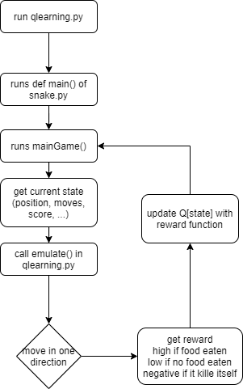
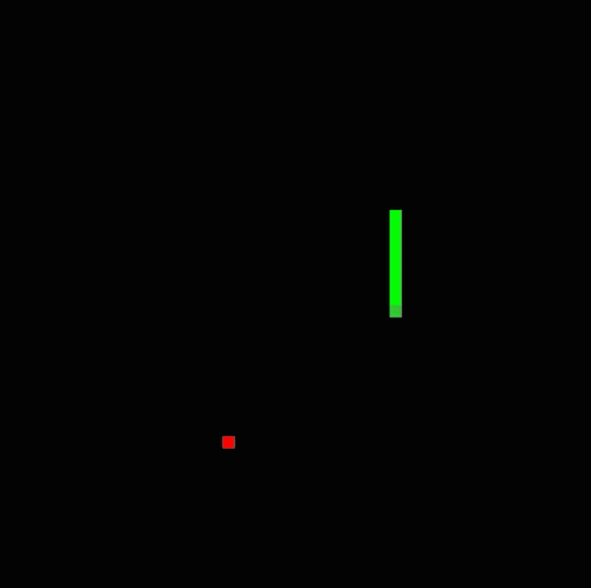

# snake-Q-Learning
Q-Learning with the classic snake game

python3 & pygame

- run "python qlearning.py t" for training
- run "python qlearning.py p" for "playing"

- qlearning.py runs snake.py and emulates the keypresses
- in traing mode it runs snake_headless.py, which disables fps ticks and graphical output for faster training

- Q-Function used:

